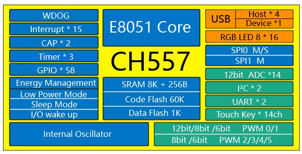

# [CH557](https://github.com/SoCXin/CH557)

#### [Vendor](https://github.com/SoCXin/Vendor)：[WCH](https://github.com/SoCXin/WCH)
#### [Core](https://github.com/SoCXin/8051)：[E8051](https://github.com/SoCXin/8051)
#### [Level](https://github.com/SoCXin/Level)：12/48MHz

## [CH557简介](https://github.com/SoCXin/CH557/wiki)

[CH557](https://github.com/SoCXin/CH557)是一款兼容MCS51的增强型E8051内核单片机，79%的指令是单字节单周期指令，运行速度快，内置64KB Flash-ROM，8K+256B RAM。
CH557内置了USB主机控制器和收发器，内置4端口USB root-hub根集线器，支持USB 2.0全速12Mbps或者低速1.5Mbps，支持USB Host主机模式和USB Device设备模式。支持最大64字节数据包，内置FIFO，支持DMA。
CH557提供丰富的接口资源，包括2组异步串口、6路PWM、14通道电容触摸按键、128组RGB三色LED控制器，其他包括2路SPI、IIC主机和IIC从机、14路12位ADC，支持电压比较；内置3组定时器和2路信号捕捉；支持最多58个GPIO。

### [资源收录](https://github.com/SoCXin/CH557)

* [文档](docs/)
* [资源](src/)

### [选型建议](https://github.com/SoCXin)

[CH557](https://github.com/SoCXin/CH557)与[CH545](https://github.com/SoCXin/CH545)定位相当

###  [SoC芯平台](http://www.SoC.Xin)
